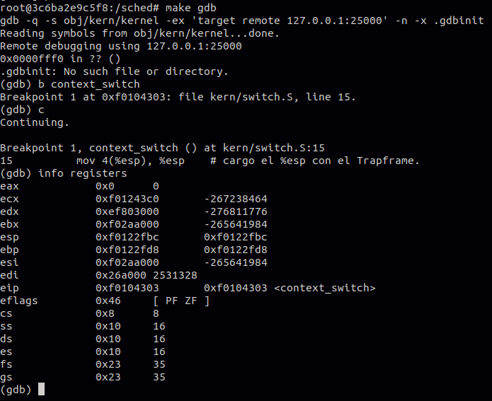
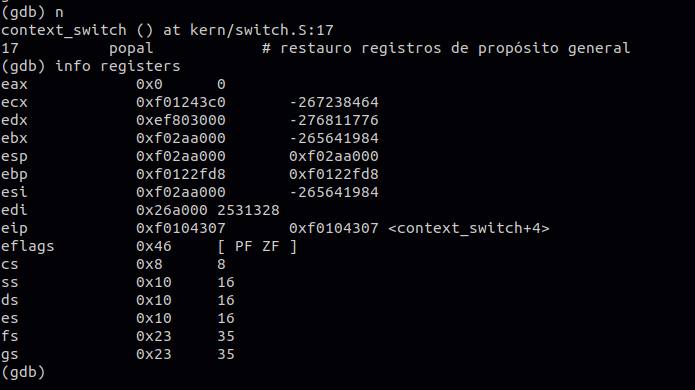
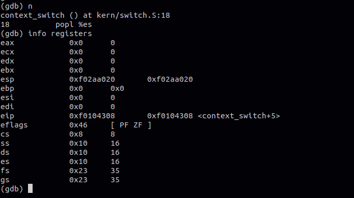
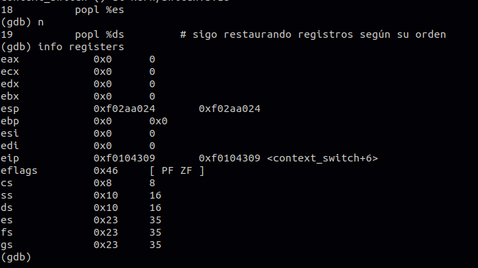
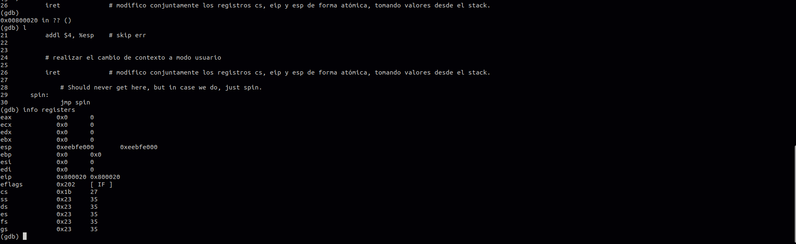
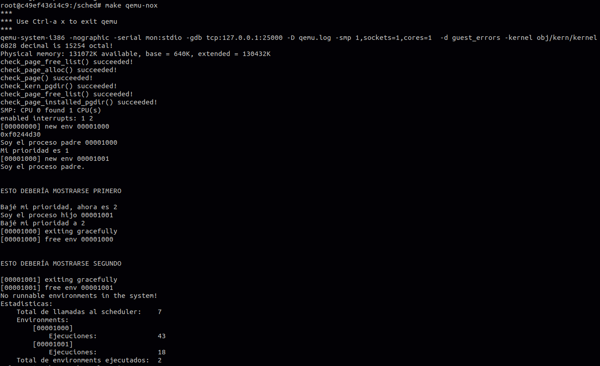

# sched

## Capturas context_switch

Registros al inicio del context_switch. Puede verse que CS está en modo kernel (8 = 00000000 000010**00**):

Actualizo el %esp:

Restauro los registros de propósito general con popal:

Restauro es:

Luego de iret. Puede verse que CS está en modo usuario (27 = 00000000 000110**11**):

## Scheduler con prioridades

Implementamos un sistema básico de prioridades controlado por el usuario.

En primer lugar, agregamos al struct de environment una variable entera llamada `env_priority`, donde el valor 1 indica la mejor prioridad. Sumamos también las syscalls `sys_env_get_priority()` para obtener la prioridad del environment llamador y `sys_env_set_priority()` para modificar la prioridad del environment indicado. Esta última syscall es segura, por lo que no se permite a un environment aumentar su propia prioridad ni disminuir la de otros, previniendo así que un proceso monopolice la CPU.

Los procesos por defecto se crean con prioridad máxima (1), pero al llamar a la syscall `sys_exofork()`, se le asigna al environment que se crea la misma prioridad que su padre.

Con respecto a la llamada al scheduler, éste selecciona para ejecutar al próximo environment del array `envs` que esté en estado `ENV_RUNNABLE` y tenga la mejor prioridad. En caso de que la prioridad máxima sea compartida por más de un environment, el proceso de selección entre ambos es idéntico al de Round Robin, incluso si uno de ellos es el environment que está corriendo actualmente. Esto significa que, si hay empate de prioridades, se tiene preferencia por los environments que no están corriendo.

Implementamos el programa de usuario `test_priority.c` para mostrar el manejo de prioridades por parte del usuario:

